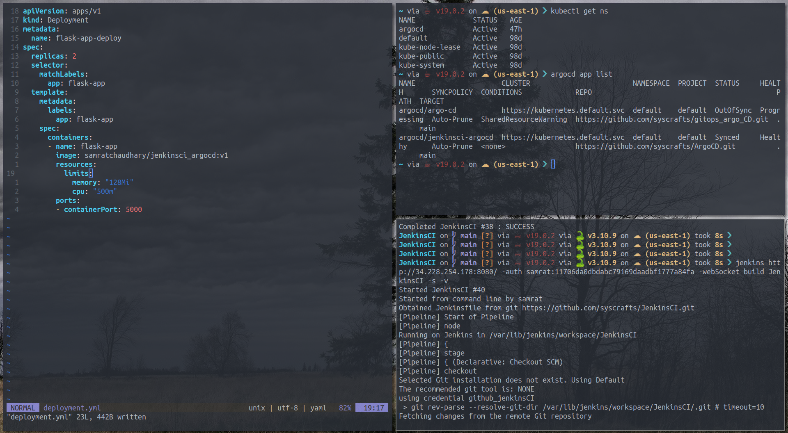
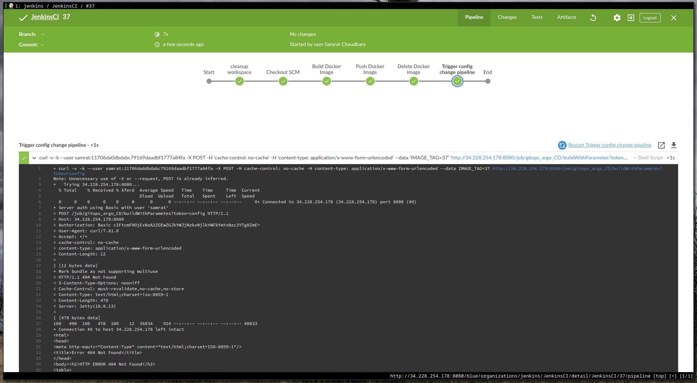

# CI/CD PIPELINE TO DEPLOY WEB APPLICATIONS TO KUBERNETES CLUSTER USING JENKINS CI PIPELINE AND ARGOCD
We are using a simple skeleton python web app for deployment. This repo along with [https://github.com/syscrafts/ArgoCD](https://github.com/syscrafts/ArgoCD) creates a Jenkins pipeline with ArgoCD to deploy code into a Kubernetes cluster. CI part is done via Jenkins and CD part via ArgoCD.

This is how it looks during Continuous Integration Process.

